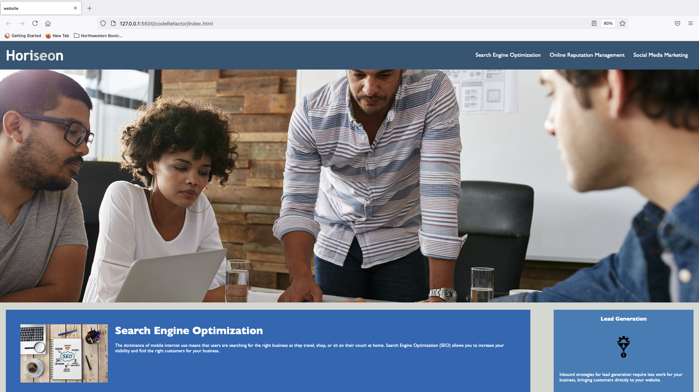

# codeRefactor
For this assignment, I added alt attributes for every image in the html to meet accessibility standards. On line 27 of the HTML, I used "aria-label" to add accessibility text to the background image stored in the class

Update: For this assignment, I replaced some the divs in the html file with semantic elements, and updated the css as not to change the styling of the webpage. 

Link to deployed application: https://jquanisha.github.io/codeRefactor/

